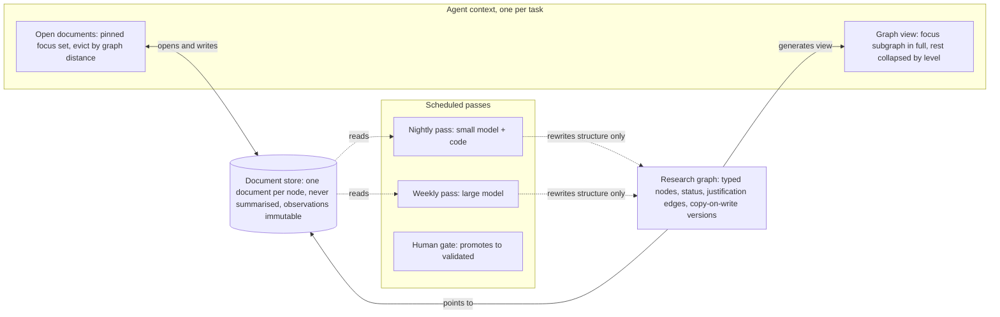
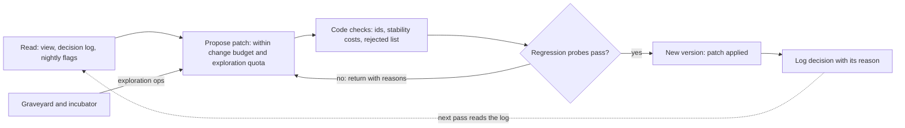

# Epistemic Index Memory: paper outline

*30 September 2026 · Olivier*

## Positioning

**Working title:** Index Lossily, Store Losslessly: Multi-Timescale Epistemic Memory for Multi-Agent Research Systems.

**Thesis: compress the map, never the territory.**

Current agent memories fit growing knowledge into a bounded context by compressing the knowledge itself: they summarise, merge and rewrite it. That erases what research runs on (scope, provenance, uncertainty, and what each conclusion rests on), freezes interpretations that later evidence overturns, and leaves agents no way to reopen what a withdrawn result supported. Long-running research agents therefore drift towards confident conclusions they can no longer justify.

We argue that research memory must instead be a living knowledge graph whose leaves are never compressed and whose structure is continuously refactored by a hierarchy of reviews: fast and local at the bottom, slow and global at the top. As knowledge grows, the reviews deepen the graph, adding levels of abstraction the way a field grows sub-fields. The map an agent carries therefore grows with the depth of the hierarchy, not with the size of the knowledge, while the territory beneath it stays complete, traceable and revisable.

**Scope:** EIM is a general memory architecture for scientific and research programmes, not a materials tool. It applies wherever a programme runs parallel hypotheses, evidence streams and decisions over months: scientific research (materials, physics, life sciences, climate) and engineering R&D (medical devices, drone sensors, automotive, defence). A synthetic running example and a real PCB placement-and-routing campaign across a board corpus (section 7) make the mechanisms concrete. Section 9 lays out the wider applications.

**Contribution claims** (each must be defended by an ablation in section 8):

1. **Index/store separation.** The context holds a generated, lossy view of a typed research graph; every node points to a lossless, addressable document. Summaries exist only as regenerable index labels, never as the only copy.
2. **Epistemic typing with dependency propagation.** Nodes carry a type (question, hypothesis, observation, claim...), a status and justification edges. Invalidating a node reopens its dependants, truth-maintenance style, so pruning means dormant, not deleted.
3. **Multi-timescale structural consolidation.** Agents write only the documents they touched; a nightly pass (small model) and a weekly pass (large model) edit topology, status and priority, never document content. Passes deepen the hierarchy as knowledge grows, and are copy-on-write and incremental: they emit audited patches with stability-weighted costs and a decision log, never rebuilds, and new ideas enter through a budgeted exploration channel.
4. **Layered ontology.** A domain-agnostic epistemic core, a pluggable domain ontology, and project extensions proposed by the weekly pass but gated.
5. **Campaign-replay benchmark.** A long-horizon research benchmark with injected perturbations (contradiction, invalidated calibration, reviving hypothesis), because conversational memory benchmarks cannot show the effect, complemented by the replay of a real PCB campaign.

**What EIM guarantees by construction, and what must be measured.** The paper separates two kinds of benefit, because reviewers will: guarantees that follow from the invariants and can be checked without any benchmark, and gains that only an experiment can show.

| Guarantee by construction | Enforced by | Current designs that lack it |
| --- | --- | --- |
| G1 No detail is lost to consolidation | Passes cannot write documents (I1) | Rolling summaries, compaction, summary-based world models |
| G2 Every claim traces to raw observations and their calibrations | Typed provenance edges (I2) | Most flat and fact-extraction memories |
| G3 Withdrawing a result reaches everything built on it, in one traversal, without model calls | Justification sets and propagation | All surveyed designs except per-fact invalidation in temporal graphs |
| G4 The structure evolves by audited patches; every past state is recoverable and no node disappears | Patch-only passes, versions, I4 | Consolidation that regenerates the store each run |
| G5 Exploration never drops below a floor | Incubator and exploration quota | None surveyed manages exploration |

**To be measured** (H1 to H8 in section 8): answer quality over long campaigns, whether the self-deepening hierarchy keeps the map bounded, cost parity, the value of timescale separation and typing, structural stability, and whether the exploration channel produces ideas that graduate.

**Target venues:** arXiv preprint plus a workshop (AI4Mat or an AI-for-science workshop at NeurIPS/ICLR) for early feedback; then either NeurIPS Datasets and Benchmarks (if the benchmark carries the paper) or an AI-for-science journal such as RSC Digital Discovery.

## Abstract (draft)

Multi-agent AI research systems now run for hours to weeks, yet their long-term memory still depends on summarising what agents did. Summaries flatten the distinctions research depends on: observation versus interpretation, bulk versus grain boundary, measured versus corrected.

We propose Epistemic Index Memory (EIM), which separates a lossy, generated index held in context from a lossless store of node-addressed documents. The index is a typed research graph (questions, hypotheses, predictions, experiments, observations, claims) with justification edges and an epistemic status per node; review passes deepen it level by level as knowledge grows, keeping the in-context map bounded while the documents beneath it stay complete.

Agents write only the documents they touched. Scheduled passes at two timescales (nightly, small model; weekly, large model) rewrite structure only: links, status, priority, and the grow, prune and reactivate decisions over the hypothesis portfolio. Pruned nodes stay dormant and reopen, truth-maintenance style, when the reason for pruning is withdrawn. Passes evolve the structure by audited patches, never rebuilds: established branches resist change in proportion to their evidence, and new ideas enter through a budgeted exploration channel. A layered ontology couples a domain-agnostic epistemic core with domain ontologies such as EMMO.

EIM is domain-agnostic: only the domain ontology and the human gate change between fields. We evaluate it on a long-horizon campaign-replay benchmark with scripted perturbations: a protocol-dependent result, a hypothesis that must split by scope, an invalidated calibration, a pruned idea that should revive, and an automated interpretation that must not be promoted; and on the recorded history of a real multi-agent PCB placement-and-routing campaign whose goal is a method that generalises across a corpus of boards. Against summary-based world models and incremental playbooks, we measure detail fidelity after N consolidation cycles, provenance traceability, contradiction detection, correct reactivation and token cost, and outline applications in other scientific fields and in regulated engineering R&D. *\[Results to come.\]*

## 1. Introduction

The introduction argues that memory, not reasoning, now limits AI research systems, and that the usual fix (summarisation) destroys exactly what research needs. Argument flow, one paragraph each:

1. **Long-horizon research agents exist and memory is their bottleneck.** Kosmos coordinates about 200 agent rollouts through a structured world model, but updates it with summaries of each task's output ([Kosmos](https://arxiv.org/pdf/2511.02824)). Coherence over weeks, not hours, is the next frontier.
2. **Summaries fail generally.** ACE shows that iterative rewriting collapses context: one rewrite shrank 18,282 tokens to 122 and accuracy fell below the no-memory baseline ([ACE](https://arxiv.org/pdf/2510.04618)).
3. **In research the loss is epistemic, not just informational.** A summary drops scope qualifiers, provenance and status. Example: first-principles work concluded that *bulk* LLZO electronic conductivity is too low to cause dendrites, and that measured values likely come from extended defects or surfaces ([preprint](https://chemrxiv.org/engage/chemrxiv/article-details/60dde02ae7f2bffc28808c22)). Summarised as "LLZO electronic conductivity is low", it wrongly refutes the defect-mediated variant of the hypothesis it actually refines.
4. **Claims get corrected, and corrections must propagate.** A-Lab initially reported 41 novel compounds; after manual re-analysis of the diffraction data, the count became 36 of 57 targets, with four ruled inconclusive from XRD alone ([correction](https://www.ncbi.nlm.nih.gov/pmc/articles/PMC12872444/), [article](https://pmc.ncbi.nlm.nih.gov/articles/10700133)). A memory that summarised the original claim cannot find everything built on it.
5. **Our approach.** Index lossily, store losslessly: a typed research graph in context, documents on demand, and consolidation that rewrites only structure. Two analogies frame it: hippocampal indexing theory (an index pointing to traces, not a copy of them) and lab practice (an immutable notebook plus an evolving research plan). The approach is general to research programmes; a synthetic running example and a real PCB campaign (section 7) make it concrete and section 9 covers the wider applications.
6. **Contributions.** The five listed under Positioning, each tied to an ablation in section 8.

## 2. Related work

No system found so far combines a lossless node-addressed store, epistemic typing with dependency-directed reactivation, structure-only multi-timescale consolidation, and a research-specific evaluation. Each row below owns one piece.

| Work | Strand | What we take | Gap we fill |
| --- | --- | --- | --- |
| [ACE](https://arxiv.org/pdf/2510.04618) (ICLR 2026) | Agent memory | Evidence of context collapse; incremental delta updates | Strategy playbooks, no graph or epistemics |
| [Infini Memory](https://awesomepapers.io/papers/2606.10677) (2026) | Agent memory | Topic documents, buffered consolidation, iterative reading | No epistemic typing, single cadence |
| [Episodic-Semantic Memory for Scientific Agents](https://arxiv.org/html/2605.17625v1) (2026) | Agent memory | Sleep-inspired tiered decay for science | Compresses into a semantic store |
| [A-MEM](https://arxiv.org/pdf/2502.12110v6) (NeurIPS 2025) | Agent memory | Zettelkasten linking | Rewrites neighbour notes at write time |
| [G-Memory](https://arxiv.org/abs/2506.07398) (NeurIPS 2025) | Agent memory | Hierarchical graphs for multi-agent systems | Task trajectories, not scientific evidence |
| Zep / Graphiti (2025) | Agent memory | Lossless episodes; invalidation instead of deletion | Fact-level; summaries at community level |
| [Letta sleep-time compute](https://letta.com/blog/sleep-time-compute) (2025) | Agent memory | Offline consolidation between sessions | Generic, content-rewriting |
| [Anthropic Dreams](https://thenewstack.io/anthropic-agent-memory-dreaming/) (2026) | Agent memory | Scheduled, copy-on-write consolidation | Merges and rewrites entries |
| [Kosmos](https://arxiv.org/abs/2511.02824) (2025) | AI scientist | Shared world model across parallel agents | World model built from summaries |
| [AI co-scientist](https://deepmind.google/blog/co-scientist-a-multi-agent-ai-partner-to-accelerate-research/) (2025, 2026) | AI scientist | Tournament, evolution, meta-review as portfolio operators | Generates and ranks ideas; we maintain their evidence over weeks |
| [SciAgents](https://arxiv.org/abs/2409.05556v1) (2024) | AI scientist | Ontological knowledge graph for materials | Graph built once from papers, not maintained |
| [Discourse graphs](https://arxiv.org/abs/2407.20666v1), micropublications | Knowledge representation | Question, claim, evidence nodes; support and oppose edges | Human authoring, no agents |
| [EMMO](https://scitepress.org/PublishedPapers/2024/129102) | Knowledge representation | Materials domain ontology with discipline modules | No epistemic status |
| JTMS (Doyle 1979), ATMS (de Kleer 1986) | Belief revision | Justification records, reopening on retraction | Symbolic, pre-LLM |
| [Dependency-directed reconsideration](https://cse.buffalo.edu/faculty/shapiro/Papers/johsha05a.pdf) (2005) | Belief revision | Removed beliefs return when the reason for removal disappears | Symbolic, pre-LLM |
| [Distributed ATMS](https://www.fe.up.pt/~mbnm/publications/daiw94.pdf) (1994) | Belief revision | Agents may hold different justified stances | Pre-LLM multi-agent |
| [Kumiho](https://arxiv.org/abs/2603.17244) (2026), BeliefMem (2026) | Belief revision | AGM semantics on graph memory | Evaluated on conversation benchmarks |

Open task: a systematic search before submission, since 2026 memory papers appear weekly.

### Where current architectures break

Six failure modes recur across current agent memory designs; each maps to one EIM mechanism and one measurable test, which is how the paper turns "better memory" into falsifiable claims.

| Failure mode | What happens | Evidence | EIM mechanism | Test |
| --- | --- | --- | --- | --- |
| Detail erosion | Rewriting or merging drops scope, conditions, calibration | ACE: one rewrite cut 18,282 tokens to 122, accuracy below baseline | Lossless store; passes never touch content | H1 |
| Dependency blindness | Withdrawing a result does not reach what was built on it | A-Lab: four claimed syntheses moved to inconclusive after re-analysis | Justification sets, withdrawal propagation | H2 |
| Status flattening | Hypotheses, interpretations and facts stored alike | Section 1: bulk vs defect-mediated electronic conductivity; 35 to 50% interlaboratory spread | Typed nodes, statuses, uncertainty | H1, H2 |
| Structural drift | Each consolidation reorganises afresh; decisions oscillate | Monolithic rewriting is the mechanism ACE identifies behind context collapse | Patch-only passes, stability costs, decision log, regression probes | H6 |
| Novelty starvation | Iterative optimisation converges on near-identical content | Brevity bias reported for iterative prompt optimisation (cited in ACE) | Incubator, exploration quota, diversity floor | H7 |
| Write collisions | Parallel agents overwrite or duplicate one another | G-Memory: multi-agent memory ignores collaboration structure | Per-document append logs, proposed edges, nightly merge | Concurrency test |

**Comparison by design family.** Ratings summarise published descriptions, not tested implementations; section 8 re-tests the main baselines. Addressed = by design; Partly = some mechanism exists; Exposed = the design is subject to the failure; Out of scope = not a goal of the design.

| Design family (example) | Detail erosion | Dependency blindness | Status flattening | Structural drift | Novelty starvation |
| --- | --- | --- | --- | --- | --- |
| Rolling summary, compaction | Exposed | Exposed | Exposed | Exposed | Out of scope |
| Fact extraction with merging (Mem0) | Partly: facts kept, sources not the unit | Partly: superseded facts replaced | Exposed | Partly: incremental updates | Out of scope |
| Temporal knowledge graph (Graphiti) | Addressed for raw episodes | Partly: contradicted facts invalidated, not their dependants | Partly: validity time, no epistemic status | Addressed: incremental | Out of scope |
| Evolving note graph (A-MEM) | Partly: notes kept, contexts rewritten | Exposed | Exposed | Partly: neighbours rewritten at write time | Out of scope |
| Offline consolidation (Letta, Dreams) | Partly: entries merged and rewritten | Partly: stale or contradicted entries replaced | Exposed | Partly: new store per run, reviewable | Out of scope |
| Summary world model (Kosmos) | Exposed in the model; statements cite sources | Exposed | Partly | Not described | Partly: parallel avenues |
| Belief-revision graph (Kumiho) | Addressed: immutable revisions | Partly: typed dependencies, AGM revision | Partly | Addressed: versioned | Out of scope |
| **EIM** | **Addressed** | **Addressed** | **Addressed** | **Addressed** | **Addressed** |

The gap EIM targets is the combination: no surveyed design addresses dependency blindness and structural drift together, and none treats exploration as part of memory.

## 3. Design principles

### Why summarisation fails research memory

Compaction has three properties that are harmless in conversation and fatal in research:

1. **Irreversibility.** A summary maps many source states to one. A qualifier it drops can only be recovered from the source, which compaction discards, so any question that depends on it has an error floor no retrieval can remove.
2. **Interpretation freezing.** A summary is written under the interpretations held when it was made. When evidence shifts later, the summary cannot be re-read under the new interpretation; the sources could.
3. **Dependency blindness.** A summary records conclusions, not what they rest on, so withdrawing a calibration or a paper cannot reach the conclusions built on it.

An index with pointers has none of these properties. Its lossy labels can be regenerated from the sources at any time, so its errors are retrieval misses, which are recoverable, rather than information loss, which is not.

### Principles

Nine principles, each testable, define the architecture; the first two are the paper's thesis.

1. **Index lossily, store losslessly.** Labels and one-line statuses in the index may be lossy and regenerated; the documents they point to are never replaced by a summary.
2. **Consolidation changes structure, never content.** Scheduled passes edit links, status, priority and grouping; only the agent that did the work writes a document.
3. **Observations are immutable; interpretations and claims are versioned.** A new reading of a diffraction pattern is a new interpretation node, not an edit of the observation.
4. **Every claim is traceable.** Claim → evidence → observation → dataset → protocol, sample and calibration, by typed edges.
5. **Pruned means dormant.** Every status change stores its justification; withdrawing that justification reopens the node.
6. **Write authority depends on timescale.** Agents write documents; the nightly pass does hygiene; the weekly pass reshapes the portfolio; a human signs off promotion to validated.
7. **Every pass is copy-on-write.** A pass produces a new graph version by applying a patch to the previous one, with a diff: never an in-place rewrite, never a rebuild from scratch.
8. **Preserve diversity.** The portfolio keeps distinct niches alive so repeated pruning cannot collapse the agenda onto a single line; new ideas enter through a budgeted exploration channel rather than through restructuring.
9. **The context is a view, generated per task.** The focus subgraph appears at full resolution; the rest is collapsed by level.

## 4. Architecture

EIM has three stores and one rule: agents read a generated view of the research graph, open documents on demand and write only what they touched; the graph itself changes only in scheduled passes.



*Figure 1. EIM architecture: agents read a generated view; only scheduled passes reshape the graph. Solid: every iteration. Dashed: scheduled passes.*

The document store is the only place content lives; everything above it is an index that can be regenerated.

- **Research graph (the index).** Each node holds an id, a type from the epistemic core, a status, an uncertainty estimate with its basis, a short regenerable label, a pointer to one document revision, and typed justification edges. The graph is versioned; every pass creates a new version.
- **Document store.** One document per node with an append-only revision log. Observations are immutable; interpretations and claims gain new revisions. The graph pins a revision, so a claim always cites the exact text it rests on.
- **Context view.** Generated per task within a token budget: the task's node and its justification neighbourhood at full resolution, the rest collapsed to family labels (question, then hypothesis family).
- **Eviction.** Pinned: the task node, the hypothesis under test and its protocol. Everything else leaves by graph distance from the focus, then least recent use. FIFO is kept only as an ablation baseline.
- **Write discipline.** Agents append to per-document logs and propose edges with status proposed. No agent changes another node's status. Conflicting writes are merged at the nightly pass.

### Formal model

At time t the memory is a pair (G, D): a research graph and a document store.

```latex
G_t = (V_t, E_t, \tau, \sigma, u, \rho, J)
```

Here τ gives each node a type from the epistemic core, σ a status, u an uncertainty with its basis, ρ a pointer to one document revision, and J a justification set: the node ids that justify the current status. D maps each document to an append-only list of revisions; observation documents have exactly one.

**Invariants,** checked after every pass and tested in the toy model:

1. **I1 content invariance.** Scheduled passes leave D unchanged; only the iteration tier appends revisions.
2. **I2 provenance.** Every observation has a produced-by edge, and a calibrated-by edge when measured; every supported claim reaches an observation through supports edges.
3. **I3 justified status.** Any status other than proposed has a non-empty J.
4. **I4 no deletion.** Nodes change status but never disappear between versions.
5. **I5 regenerable view.** The context view is a pure function of the graph version, the focus and the budget.

**Status transitions:**

| From | To | Trigger | Tier |
| --- | --- | --- | --- |
| proposed | active | Selected for investigation | Weekly |
| active | supported, contested or refuted | Evidence weighed against the prediction | Nightly propagation; weekly judgement |
| supported | validated | Replication across independent provenance, no open contradiction | Human gate |
| active or contested | dormant | Low expected information gain, no active dependants; J stored | Weekly |
| dormant | active | J emptied by withdrawals, or new evidence on its assumptions | Event or weekly |
| supported or validated | contested | A node in its justification is withdrawn | Nightly or event propagation |
| any | superseded | Split or merge | Weekly |

**Withdrawal propagation.** When a node x is withdrawn (refuted, retracted, or a calibration invalidated), every dependant reachable backwards along depends-on, derived-from, calibrated-by and supports edges that is active, supported or validated becomes contested, with x added to its justification. For every dormant node whose justification contains x, x is removed; a dormant node whose justification becomes empty is a reactivation candidate. This is dependency-directed reconsideration applied to a research graph, at a cost linear in the size of the graph per withdrawal.

**View and eviction.** The view around a focus f shows its 2-hop justification neighbourhood in full and collapses the rest to family labels with status counts, within a token budget B. Outside the pinned set (task node, hypothesis under test, its protocol), an open document d is evicted in decreasing order of:

```latex
s(d) = \alpha \, \mathrm{dist}_G(d, f) + \beta \, \mathrm{age}(d)
```

where age counts the steps since d was last read. FIFO corresponds to α = 0 with age measured from opening rather than last use.

## 5. Multi-timescale consolidation

Four tiers share one rule: the faster the tier, the less it may change. Periods are parameters; daily and weekly are defaults.

| Tier | Trigger | Actor | May change | May not change |
| --- | --- | --- | --- | --- |
| Iteration | End of each agent task | The working agent | Documents it touched; new observation and analysis nodes; proposed edges | Other nodes' status; anything outside its task |
| Nightly | Daily, or every N iterations | Small model + deterministic code | Accept or reject proposed edges; merge duplicate nodes by alias; flag contradictions; recompute priority; propagate dependencies; refresh index labels | Prune, reactivate, restructure branches |
| Weekly | Weekly | Large model | Split or merge hypotheses; open new questions; prune to dormant; reactivate; rebalance the portfolio; propose ontology extensions | Document content; promotion to validated |
| Event | Surprising result, invalidated calibration, contradiction on a high-priority claim | Nightly machinery, immediately | Same as nightly; may schedule an early weekly pass | Same as nightly |
| Human gate | Weekly, or on demand | Researcher | Promote to validated; accept ontology changes | Nothing is off limits |

**Split of labour inside a pass.** The model judges locally (is this a contradiction, does this evidence support that claim); deterministic code propagates status through dependency edges. IBM's EoG uses the same split for abductive diagnosis ([EoG](https://arxiv.org/html/2601.17915v2)). It keeps propagation auditable and cheap.

**Portfolio operators for the weekly pass.**

- **Grow:** open questions or hypotheses where competing explanations remain undiscriminated and a discriminating experiment is affordable.
- **Prune to dormant:** low expected information gain, high cost, no active dependants. The justification is stored.
- **Reactivate:** the stored justification is withdrawn, new evidence touches the node's assumptions, or a random sample of dormant nodes is re-reviewed each cycle.
- **Rebalance:** keep a minimum number of active niches (mechanism families, material classes) so pruning cannot collapse the agenda.

Open question: whether the weekly model should run a pairwise tournament over hypotheses, co-scientist style, or score them independently.

**Cost model.** Per iteration, a rolling summary costs roughly S + e tokens (summary size S, event size e), plus a daily rewrite of S and the day's events. EIM costs roughly B + k·d tokens (view budget B, k open documents of mean size d). Both are bounded and independent of campaign length. EIM adds storage, which grows linearly and is cheap, and scheduled passes: the nightly pass scales with the day's diff, the weekly pass with flagged nodes plus the collapsed view. The claim to test is per-iteration cost parity within the same order of magnitude, with the weekly pass amortised over the week. Correction cost is where the designs differ most: when a calibration is invalidated, a summary memory can only be repaired by re-reading the raw history, if it still exists, so the cost grows with campaign length; EIM repairs the graph by traversal with no model calls and sends only the flagged set to the next review.

### Incremental evolution

Reviews evolve the structure; they never rebuild it. Five mechanisms keep past learning in force, and a sixth keeps room for new ideas.

1. **Patches, not rebuilds.** A pass outputs typed operations against the current version: add, link, split, merge, prune to dormant, reactivate, relabel, and the refactoring operations below. Anything not named stays unchanged, and code applies the patch.
2. **Permanent identities.** Node ids never change. Splits and merges create new nodes linked by supersedes edges; a patch that leaves any old id unaccounted for is rejected.
3. **Stability-weighted change.** Each node's stability grows with its evidence, age and dependants, and an operation costs more on stable nodes. Each tier has a change budget; an operation citing new contradicting evidence is discounted. Young hypotheses move freely, established branches move only on evidence or human approval: the structural analogue of elastic weight consolidation in continual learning. Broad reorganisations are rare, scheduled and human-reviewed.
4. **Decision memory.** A log records every split, merge and prune with its reason. A pass may not reverse a logged decision without evidence newer than it, which prevents oscillation. Rejected proposals are logged too, so they are not re-proposed each week. Hysteresis sets the bar to promote above the bar to keep.
5. **Regression probes.** Each region of the graph keeps canonical questions with known answers; a patch is accepted only if they still resolve. Structure changes are tested like code changes.
6. **A separate channel for new ideas.** New ideas enter an incubator that cannot reshape the core and graduate when evidence supports them. A fixed exploration quota of proposals and experiment budget protects them from pruning, and a diversity floor keeps several niches active. Generation starts from history: each idea cites its parents, and operators vary a supported hypothesis, recombine branches, import an idea from another branch or field, test the negation of a consensus claim, revisit a dormant idea under new evidence, or fill an open question with no hypothesis. The graveyard of dormant and refuted ideas, with their reasons, feeds generation so ideas are not repeated.

```latex
\mathrm{stab}(v) = w_e \, n_{\mathrm{evidence}}(v) + w_a \, \mathrm{age}(v) + w_d \, n_{\mathrm{dependants}}(v), \qquad \mathrm{cost}(o, v) = c_o \, (1 + \mathrm{stab}(v))
```

A pass accepts operations while their total cost stays within its tier's budget.



*Figure 2. Weekly pass: reviews patch the graph; they never rebuild it.*

The weekly pass reads the view, the decision log and the nightly flags, proposes one patch mixing maintenance and exploration operations, and applies it only after code checks and regression probes pass; either way the outcome is logged for the next pass.

### Self-deepening hierarchy

The graph grows in depth as well as in size. When a node's children exceed a fan-out bound, or a coherent cluster appears across branches (a mechanism family, a material class, a recurring artefact), the weekly pass inserts an abstraction node between the cluster and its parent; when a level stops earning its place, it is dissolved. Abstraction nodes are index nodes: their label is regenerated from their members and their content stays in the leaves, so deepening never compresses knowledge.

Deepening is what keeps the map bounded. With fan-out bounded by k, a graph of N nodes needs a depth of order log_k N. The context view shows the path from the root to the focus with the siblings along it, so its size grows with depth times fan-out rather than with N:

```latex
|\mathrm{view}| = O(k \log_k N)
```

Three refactoring operations join the patch vocabulary: introduce level, dissolve level, re-parent. They obey the same rules as every other operation (permanent ids, stability costs, decision log, regression probes), so the hierarchy evolves the way a research field does: sub-fields appear as evidence accumulates, and reorganisations are rare, justified and traceable.

## 6. Research workflow, objects and ontology

Research programmes run as a loop of six phases, not a pipeline; the memory's objects, properties and cadences follow that loop rather than an engineering design, build and verify cycle.

### Research workflow

1. **Research direction and questions.** Scientific ambition, state of the art, key unknowns, constraints and research questions.
2. **Hypotheses and research strategy.** Competing hypotheses, expected signatures, what would discriminate them, and the most informative paths first.
3. **Investigation and experimentation.** Theory, simulation, synthesis, experiments, measurement and data acquisition; several branches run in parallel.
4. **Analysis and scientific interpretation.** Data processing, uncertainty, comparison with models, observations kept apart from interpretations, contradictions flagged.
5. **Evidence and validation.** Replication, controls, alternative explanations, sensitivity analysis, independent review, systematic errors and reproducibility.
6. **Knowledge and research decisions.** What is supported, contested, rejected or still unknown; the knowledge base updated; the next question or experiment chosen.


*Figure 3. Research runs as a loop: each result updates the hypotheses.*

The core loop is hypotheses → investigation → interpretation → evidence → updated hypotheses; phase 1 is re-entered only when a knowledge update opens new questions.

| Phase | Main objects written | Memory tier that owns it |
| --- | --- | --- |
| 1 Direction and questions | Research questions, constraints | Weekly pass; human gate |
| 2 Hypotheses and strategy | Hypotheses, predictions, planned experiments | Weekly pass |
| 3 Investigation | Experiments, simulations, samples, protocols, datasets, observations | Iteration (agents) |
| 4 Interpretation | Analyses, interpretations, contradiction flags | Iteration; nightly flags |
| 5 Evidence and validation | Evidence with its uncertainty, replications, controls | Iteration; event pass |
| 6 Knowledge and decisions | Claim status changes, knowledge, decisions | Weekly pass; human gate |

### Research objects

The canonical chain is research question → hypothesis → prediction → experiment or simulation → dataset → observation → interpretation → evidence → claim → knowledge. Protocols, samples, instruments, calibrations, analyses and decisions hang off it as supporting objects.

Four transverse properties sit on every object:

| Property | Question it answers | How EIM stores it |
| --- | --- | --- |
| Provenance | Where does this come from? | Produced-by and derived-from edges down to sample, instrument and calibration |
| Uncertainty | How strong is it? | A per-node estimate with its basis: statistics, replication count, method |
| Dependencies | What does it rely on? | Depends-on edges; withdrawing a node reopens its dependants |
| Status | Where does it stand? | Epistemic status with the ids that justify it |

### Ontology layers

Three layers with decreasing stability: the epistemic core never changes during a campaign, the domain layer is pinned to a version, and the project layer grows under human control.

| Layer | Contents | Reuse | Who changes it |
| --- | --- | --- | --- |
| Epistemic core | Node types: question, hypothesis, prediction, experiment, simulation, protocol, sample, instrument, calibration, dataset, analysis, observation, interpretation, evidence, claim, knowledge, decision. Edges: addresses, predicts, tests, produced-by, calibrated-by, derived-from, supports, contradicts, depends-on, supersedes | Discourse graphs, micropublications, PROV-O (provenance), ECO/SEPIO (evidence types) | Nobody during a campaign |
| Domain (materials) | Materials, processes, characterisation methods, properties, units | EMMO with CHAMEO for characterisation; OPTIMADE and NOMAD metainfo for computed data; QUDT for units | Pinned version, upgraded between campaigns |
| Project | Local concepts the domain layer lacks, such as stack pressure during impedance measurement or a specific interface treatment | Proposed by the weekly pass | Human approval only |

**Epistemic status values** (on hypotheses and claims): proposed, active, supported, contested, refuted, dormant, validated, superseded. There is deliberately no "abandoned": an abandoned line is dormant with its justification stored, so it can reopen. Every transition stores the node ids that justify it.

The domain layer is what transfers: for physics, swap in PhySH as taxonomy and analysis-preservation records as provenance, and keep the core unchanged.

## 7. Case studies

Two cases make the mechanisms concrete: a synthetic running example with scripted perturbations, and a real multi-agent campaign in PCB placement and routing whose recorded history can be replayed.

### Running example: a synthetic materials campaign

One running example makes the mechanisms concrete, and its events are also the benchmark perturbations of section 8. It is drawn from solid-state electrolyte research because every perturbation it needs has a documented real-world counterpart there, listed in the last column. Nothing in the architecture depends on this field.

Campaign objective, for lithium-metal batteries: find a doped garnet or argyrodite electrolyte above 1 mS/cm at room temperature and explain why lithium dendrites still short the cell.

| Week | Event | EIM response | What a summary memory loses | Real-world counterpart |
| --- | --- | --- | --- | --- |
| 1 | Questions opened: which dopants raise conductivity (Q1); why dendrites form (Q2). Hypotheses H2a mechanical cracks, H2b electronic conductivity, H2c interface leakage | Nodes typed and linked; all three kept active as distinct niches | Nothing yet | Competing dendrite mechanisms in the literature (Porz et al. 2017; Han et al. 2019) |
| 3 | Impedance on sample S-17 gives a high conductivity; literature agent adds the round-robin spread | Observation stores stack pressure, electrodes, fit model; claim "dopant D raises conductivity" set to contested until same-protocol replication | Keeps the number, drops the protocol | Round-robin: identical samples measured from 1.3 to 5.8 mS/cm across laboratories ([Ohno et al. 2020](https://par.nsf.gov/servlets/purl/10212129)) |
| 5 | Operando evidence of lithium inside the bulk | Supports H2b; linked to its dataset and method | Records "H2b supported" | Operando profiling of lithium inside LLZO and Li3PS4 ([Han et al. 2019](https://scholars.duke.edu/publication/1558125)) |
| 6 | DFT agent: bulk electronic conductivity negligible | Weekly pass splits H2b into H2b-bulk (refuted, scope: bulk) and H2b-defect (under test, merged with H2c) | Stores "electronic conductivity is not the cause" and prunes the right branch | First-principles result pointing to defects or surfaces ([preprint](https://chemrxiv.org/engage/chemrxiv/article-details/60dde02ae7f2bffc28808c22)) |
| 8 | Impedance cell geometry factor found wrong (calibration CAL-3) | Event pass flags every observation calibrated by CAL-3; dependent claims revert to contested; dopant E, pruned in week 4 on those numbers, reactivates | Cannot find what depended on CAL-3 | Synthetic; stands for any invalidated calibration or retracted source |
| 10 | Autonomous synthesis reports a new phase from an automated XRD fit | Stored as an interpretation with confidence; promotion blocked until composition analysis | Reports a "new material" | Disputed automated phase identification in A-Lab; four successes moved to inconclusive ([Leeman et al. 2024](https://par.nsf.gov/servlets/purl/10532478), [correction](https://www.ncbi.nlm.nih.gov/pmc/articles/PMC12872444/)) |

### Real campaign: PCB placement and routing across a board corpus

The second case is a live R&D campaign that already runs on EIM's structure by hand. A PCB placement engine (canonical KiCad model, multi-start simulated annealing, KiCad DRC, routing through KiCadRoutingTools) is developed and evaluated by coding agents, a reviewer model and an owner. The goal is a placement method that generalises across a corpus of boards, not an optimum for one board: StickHub is the board under study, saved-result regressions on three others (PIC, Multichannel, Sonde) must stay no-ops, and a cold-start run on all four boards precedes any change of default.

| EIM concept | In the PCB campaign |
| --- | --- |
| Hypotheses with status | Hypothesis tree H1 to H6: refuted, unresolved, untested, deferred |
| Document store | One RESULTS file per task; PLAN, REVIEW and HANDOVER files |
| Provenance | A commit per result; archived board files per checkpoint |
| Calibrations | Legality-model epochs (for example a change to pad-corner and via geometry), gate versions, rule epochs |
| Observations | DRC errors, unrouted connections, eligible edges, router calls |
| Reproducibility | Operation replays compared exactly |
| Regression probes | Saved-result regressions on the other boards |
| Weekly pass | Reviews by a reviewer model that re-plan the next steps |
| Human gate | The owner: any drift from the plan goes to the owner before execution |
| Generated view | A convergence map republished at every task boundary, today by hand |
| Agent handover | An inventory-verified takeover between two coding agents |

**Where hand-maintained memory shows strain.** A snapshot of the convergence map (29 to 30 September 2026) shows four of the failure modes of section 2, each with the EIM mechanism that removes it:

1. **Identifier reuse.** One label names two different hypotheses: an adaptive area search in the backlog, and a partial-band test that was refuted. Permanent ids and supersedes edges prevent this.
2. **Status divergence.** One hypothesis reads "unresolved" in the plan and "closed" in the tree. A single graph with generated views makes divergence impossible.
3. **Manual epoch propagation.** After a legality-model change, the results computed under the old model have to be found and re-qualified by hand. Epochs as calibration nodes make this a withdrawal propagation.
4. **Scope carried in prose.** Board-level results ("kernel-04 is best on StickHub") and corpus-level questions ("which placement family generalises?") share one tree, and the scope lives in wording such as "StickHub only". A corpus > board > hypothesis-family hierarchy makes scope structural, and corpus-level claims require held-out boards.

**Why it matters for the paper.** It gives a real, non-synthetic history; its roles already match EIM's tiers; its corpus goal puts scope and generalisation at the centre; and its observations are machine-checkable (DRC counts, exact replays), so gold answers are cheap to verify. The domain layer is small: board, net, pad, placement pose, kernel family, routing run, DRC error, legality model, rule set, checkpoint. Publication uses the pseudonymised branch of the campaign.

**Repository.** The campaign lives in the BConnect PCB placement engine repository (remote URL to add). Snapshot used here: published branch `codex/stickhub-stiffness-pilot` at `e558eaa` (pseudonymised); at the snapshot the local head was `14388e7`, not yet pushed. Plan and reviews: `docs/PLAN-2026-09-29-best-of-pipeline.md`, `docs/REVIEW-2026-09-29-best-of-pipeline.md`, and the 30 September review (commit `4846bba`). Handover: `docs/HANDOVER-2026-09-29-CLAUDE-EXPERIMENTS.md` and `benchmarks/handover/2026-09-29-claude-takeover.json`. Results: the `docs/RESULTS-2026-09-*.md` series, one file per task. Live view: [StickHub Convergence Map](https://claude.ai/artifact/5PfjXNa2NooWaFqF6sF4VD). Replay build instructions: BRIEF.md (EIM toy model: build brief for Claude Code).

## 8. Evaluation

Evidence comes from three tracks: a 12-week replay of the running example with scripted perturbations (Track A, controlled), the recorded history and a live pilot of the PCB campaign (Track B, real), and DiscoveryWorld as a check on generality (Track C).

### Hypotheses tested

1. **H1 detail fidelity.** Summary-based systems lose accuracy on qualifier questions as consolidation cycles accumulate; EIM does not (claim 1).
2. **H2 dependency correctness.** Only systems with explicit dependencies answer dependency-impact and reactivation questions above chance (claim 2).
3. **H3 timescale separation.** One-tier variants either cost more (a large model every night) or restructure worse (a small model doing weekly work) (claim 3).
4. **H4 typing pays.** The ontology layers improve alias resolution and typed queries (claim 4).
5. **H5 cost parity.** EIM's per-iteration tokens stay within the same order of magnitude as the rolling summary's, and a withdrawn calibration is repaired with no model calls.
6. **H6 structural stability.** Patch-based evolution shows lower churn and no decision oscillation compared with a variant that rebuilds the structure every week, at equal or better probe accuracy (claim 3).
7. **H7 productive exploration.** With the exploration channel, more distinct niches stay active and some incubated ideas graduate on evidence; without it, the agenda narrows (claim 3).
8. **H8 bounded map.** As the graph grows, hierarchy depth and view size grow sub-linearly while answer quality holds; a flat graph's view either overflows its budget or loses resolution (claim 3).

### Pilot: toy model

A toy model runs before Track A: a synthetic 12-week campaign with the scripted perturbations of section 7, replayed through EIM, a rolling summary, a full-context baseline and the ablations. It tests H1, H2 and H5 cheaply and hardens the harness before real data. Build brief: BRIEF.md (EIM toy model: build brief for Claude Code).

### Track A: campaign replay (main)

- **Material:** OBELiX entries (about 600 synthesised electrolytes with measured conductivity) and their source papers, computed properties from the Materials Project, a curated set of dendrite-mechanism papers, and synthetic lab-notebook events with full metadata.
- **Replay:** events released on a simulated clock; agents run iterations; nightly and weekly passes fire on schedule.
- **Perturbations:** the six events of section 7, plus duplicate entities under different names (LLZO and Li<sub>7</sub>La<sub>3</sub>Zr<sub>2</sub>O<sub>12</sub>, Ga-LLZO and Ga-doped garnet).
- **Probes after each weekly cycle:** questions with gold answers, e.g. "what stack pressure was S-17 measured at?", "which claims depend on CAL-3?", "what is the status of H2b-bulk and why?".

### Track B: PCB campaign (real)

- **Replay.** Convert the campaign's history into an ordered event stream (commits, RESULTS, PLAN, REVIEW and HANDOVER files, pseudonymised) and replay it through EIM, the baselines, and current practice: handover summaries plus the hand-maintained map.
- **Probes from real review questions,** with gold answers signed off by the owner: the status and scope of each hypothesis; which results predate a legality-model epoch; the latest safe checkpoint; which boards back a corpus-level claim; which decisions await the owner.
- **Live pilot.** For the next several review cycles, EIM regenerates the convergence map at each task boundary beside the hand-maintained one. Measure divergences between the two, time spent maintaining the map, and review decisions that cite graph-provided evidence.
- **Corpus protocol.** Generalisation hypotheses are scored on held-out boards only, and transferring a board-level finding to another board is itself a hypothesis node.

Track B stresses H2 (epoch changes are withdrawals), H6 (status stability across reviews) and H8 (a corpus level above boards) on real data.

### Track C: DiscoveryWorld (secondary)

[DiscoveryWorld](https://arxiv.org/abs/2406.06769v1) offers 120 simulated discovery tasks over eight topics and three difficulty levels. It tests generality but runs too short to stress weekly consolidation, so it supports rather than carries the paper.

### Metrics

| Metric | Definition | Tests claim |
| --- | --- | --- |
| Detail fidelity at k | Accuracy on qualifier questions (units, scope, conditions) after k consolidation cycles | 1 |
| Provenance precision and recall | Justification paths returned vs gold paths | 2 |
| Reactivation accuracy | Dormant nodes correctly reopened after a withdrawn justification, and false reopenings | 2 |
| Status accuracy | Node statuses vs expert gold after each cycle | 2, 3 |
| Contradiction latency | Cycles between contradicting evidence and its flag | 3 |
| Portfolio diversity | Active niches over time | 3 |
| Ontology benefit | Duplicate-entity merges and typed-query accuracy with vs without the domain layer | 4 |
| Cost | Tokens and wall-clock per iteration and per cycle | Practicality |
| Expert rating | Quality of weekly memos and proposed next experiments | Overall |

**Structural metrics** (H6 to H8): churn per pass (share of nodes whose placement or status changed), oscillation count (decisions reversed without new evidence), regression-probe pass rate, exploration share, incubator graduation rate, active niches over time, and hierarchy depth and view size against graph size.

### Baselines and ablations

**Baselines:** full context until overflow; rolling summary; a Kosmos-style summary world model (re-implemented); ACE playbook; A-MEM; Graphiti; Infini-Memory-style topic documents. Same backbone models everywhere.

**Ablations, one per claim:**

1. Summaries instead of pointers (claim 1).
2. No epistemic typing, no dependency propagation (claim 2).
3. Nightly only, weekly only, and the same model at both tiers (claim 3).
4. Rebuild: the weekly pass regenerates the structure from scratch, with no patches, stability costs or decision log (H6).
5. No exploration channel: new ideas compete directly in the portfolio (H7).
6. Flat: no deepening, a fixed two-level hierarchy (H8).
7. Generic entity extraction instead of the ontology layers (claim 4).
8. FIFO vs focus-based eviction, and in-place vs copy-on-write passes (design choices).

## 9. Applications: other sciences and regulated engineering

In regulated engineering, compaction is not a performance problem but a compliance problem: automotive, aviation, medical and defence programmes must already show an unbroken trail from claim to evidence, which is the structure EIM keeps by design.

Within science, the core and cadence carry over unchanged and only the domain layer is swapped: PhySH and analysis-preservation records for physics, OBI and the Gene Ontology for life sciences, model and run metadata for climate simulation campaigns. The table below focuses on regulated engineering R&D, where the need for lossless, traceable memory is strongest.

The bridge is the assurance case. Assurance 2.0 records doubts as defeaters that are developed into subcases confirming or refuting them ([Bloomfield, Netkachova and Rushby 2024](https://www.csl.sri.com/~rushby/abstracts/defeaters24)). A defeater is a contradicting node; a refuted defeater is a dormant node that can reopen. The epistemic core therefore maps onto assurance vocabularies (GSN, SACM) with a domain-layer swap, not a redesign.

| Domain | Typical campaign | Graph maps onto | Where EIM adds most | Human gate |
| --- | --- | --- | --- | --- |
| Medical devices | Design and development, ISO 14971 risk management, clinical evaluation, post-market surveillance | Requirements to verification evidence; hazards to risk controls to verification; the design and development file | A complaint trend reopens a closed risk estimate and every design decision it justified; traceability generated from the graph, not kept by hand | Design review; risk management owner |
| New drone sensors | Bench-to-flight characterisation of a new modality: event cameras, mmWave radar, quantum magnetometers for GPS-denied navigation, hyperspectral payloads | Noise-source hypotheses (rotor EMI, vibration, thermal drift); calibration chains; flight-test conditions | Calibration and firmware version as dependency nodes: a corrected calibration or firmware fix reopens every flight-test conclusion that used it | Sensor lead; airworthiness engineer |
| Automotive | ADAS and automated-driving validation; battery cell R&D, including solid-state cells | Safety case under ISO 26262, SOTIF (ISO 21448) triggering conditions, UL 4600 | A field incident or new scenario reopens safety claims; unknown scenarios kept as open questions | Functional safety assessor |
| Defence R&D (general) | Multi-year programmes, test and evaluation, readiness-level gates | Readiness gates as claims needing evidence; test campaigns as experiments | Need-to-know compartments as access-controlled subgraphs with redacted index views; export-control tags on nodes; on-premise models for scheduled passes; memory that survives staff turnover | Programme authority; security officer |

**What changes per domain:** the domain layer, the human gate (a regulatory role rather than a researcher), and access control, which becomes a node property. **What stays:** the epistemic core, the cadence and the copy-on-write rule.

**Timing matters for medical devices.** FDA's QMSR took effect on 2 February 2026 and incorporates ISO 13485:2016 by reference ([overview](https://lanpdt.com/fda-qmsr-2026-medical-device-prototyping/)); design records now centre on the medical device file and the design and development file ([DDF transition](https://intuitionlabs.ai/articles/qmsr-dhf-remediation-medical-device-file-transition)). Teams are restructuring their records now, which is a window for a graph-native approach.

**Suggested order for follow-up work:**

1. **Medical devices:** traceability is legally required, post-market data naturally triggers reactivation, and an in-house connected-health design and development file (Baracoda) would give a real, non-synthetic replay, which the materials benchmark lacks.
2. **Drone sensors:** calibration and firmware dependencies are central, and test cycles are short enough to run several consolidation cycles per month.
3. **Automotive:** strong fit, but standards-heavy and dominated by incumbents' toolchains.
4. **Defence:** strongest need for compartmented memory, but access and publication constraints make it a late target. Scope stays on R&D knowledge management, with an ethics and dual-use statement in the paper.

In the paper itself this section is a one-page discussion; each domain is a candidate follow-up study.

## 10. Limitations and risks

The main risk moves from forgetting to mis-structuring: a wrong weekly restructure is fast to spread and slow to notice.

- **Consolidator error.** Mitigated by copy-on-write versions, reviewable diffs and the human gate on promotions; the paper should report how often experts reject a weekly diff.
- **Retrieval cost grows with the store.** Storage is cheap, but the generated view must stay bounded as the graph reaches thousands of nodes.
- **Weekly pass cost.** A large model cannot open every document; it works from flags and a budget, which can miss unflagged problems.
- **Mis-typing.** A model that types an interpretation as an observation defeats principle 3; typing accuracy must be measured.
- **Concurrent writes.** Parallel agents on one document need per-document append logs merged at the nightly pass.
- **Poisoned or retracted sources.** Literature nodes need a retraction check, since a retracted paper is a withdrawn justification.
- **Benchmark realism.** Track A's events are synthetic; Track B is real but comes from one team and one tool chain; neither alone proves generality across fields.

## Open questions and next steps

The critical path is the toy model first (brief in BRIEF.md), then the replay harness; the PCB campaign supplies real data and an owner for gold answers, so Track B can start before an external partner is found; the architecture can be built in parallel.

- [ ] Choose the first venue and its deadline (workshop vs Datasets and Benchmarks track)
- [ ] Run a systematic search of 2025 to 2026 agent-memory papers and any LLM work on truth maintenance
- [ ] Write the epistemic core as a schema and map it to PROV-O and the discourse-graph model
- [ ] Find a solid-state electrolyte group to write gold answers and rate weekly memos
- [ ] Build replay harness v0: 20 OBELiX materials, 30 papers, the six perturbation events
- [ ] Implement the nightly pass with deterministic propagation first, the weekly pass second
- [ ] Decide eviction experiments: FIFO, LRU, focus-based

Open questions:

1. Pairwise tournament or independent scoring for the weekly portfolio pass?
2. A cheap proxy for expected information gain when choosing what to grow?
3. Release the benchmark as its own paper, or keep it inside this one?

### PCB track: next steps

- [ ] Freeze a pseudonymised snapshot of the campaign repository as the Track B corpus, with a manifest of files and commits
- [ ] Write the PCB domain layer and map each file type to node types: RESULTS to experiments and observations, REVIEW to decisions and status changes, PLAN to questions and priorities, HANDOVER to context transfer
- [ ] Reconstruct the graph for one review cycle by hand with the owner, as gold, and measure how much an extractor recovers automatically
- [ ] Draft about 40 probes from past review questions, with owner-signed gold answers
- [ ] Add a "current practice" baseline to the toy harness and run the Track B replay
- [ ] Start the live pilot at the next task boundary: EIM regenerates the map beside the hand-maintained page
- [ ] Add the corpus level: register all four boards and tag every result and hypothesis with its board scope

### Improvements to the campaign, useful with or without EIM

1. **Permanent hypothesis ids.** When a hypothesis is split or reworded, create a new id that supersedes the old one instead of reusing the label.
2. **One status source.** Keep a single status table and generate the tree, the module list and the map from it.
3. **Epoch tags on every result.** Record the legality model, gate, rule set and router version each result ran under; on an epoch change, list the affected results automatically before re-qualifying.
4. **Board scope vs corpus scope.** Board-level findings sit under each board; corpus-level hypotheses sit above them and name their held-out boards.
5. **Decision log.** Record each owner decision and each refusal with its reason, so a later review cannot reverse it silently.
6. **Protected exploration.** Give backlog hypotheses (adaptive area search, operation selector, learned ranking) a small, fixed share of the budget instead of waiting for the main line to finish.

## Working references

Linked items were checked on 30 September 2026; unlinked classics are cited from memory and need verifying.

**Agent memory and AI scientists**

- Zhang et al., [Agentic Context Engineering](https://arxiv.org/pdf/2510.04618), ICLR 2026
- Ji et al., [Infini Memory](https://awesomepapers.io/papers/2606.10677), 2026
- [Episodic-Semantic Memory Architecture for Long-Horizon Scientific Agents](https://arxiv.org/html/2605.17625v1), 2026
- Xu et al., [A-MEM](https://arxiv.org/pdf/2502.12110v6), NeurIPS 2025
- Zhang et al., [G-Memory](https://arxiv.org/abs/2506.07398), NeurIPS 2025
- Park, [Kumiho: belief revision for graph memory](https://arxiv.org/abs/2603.17244), 2026
- Letta, [Sleep-time compute](https://letta.com/blog/sleep-time-compute), 2025
- Rasmussen et al., Zep: a temporal knowledge graph architecture for agent memory, 2025
- [Kosmos](https://arxiv.org/abs/2511.02824), Edison Scientific, 2025
- Google DeepMind, [Co-Scientist](https://deepmind.google/blog/co-scientist-a-multi-agent-ai-partner-to-accelerate-research/), 2026
- Ghafarollahi and Buehler, [SciAgents](https://arxiv.org/abs/2409.05556v1), 2024
- Jansen et al., [DiscoveryWorld](https://arxiv.org/abs/2406.06769v1), NeurIPS 2024
- IBM Research, [Explanations over Graphs](https://arxiv.org/html/2601.17915v2), 2026

**Knowledge representation and belief revision**

- Chan et al., [Steps towards an infrastructure for scholarly synthesis](https://arxiv.org/abs/2407.20666v1), 2024
- Del Nostro et al., [EMMO perspectives](https://scitepress.org/PublishedPapers/2024/129102), 2024
- Johnson and Shapiro, [Dependency-directed reconsideration](https://cse.buffalo.edu/faculty/shapiro/Papers/johsha05a.pdf), AAAI 2005
- Malheiro, Jennings and Oliveira, [Distributed belief revision](https://www.fe.up.pt/~mbnm/publications/daiw94.pdf), 1994
- Doyle, A truth maintenance system, 1979; de Kleer, An assumption-based TMS, 1986
- Teyler and DiScenna, hippocampal memory indexing theory, 1986

**Running example sources**

- Ohno et al., [Interlaboratory study of thiophosphate conductivities](https://par.nsf.gov/servlets/purl/10212129), ACS Energy Letters 2020
- Han et al., [High electronic conductivity as the origin of lithium dendrites](https://scholars.duke.edu/publication/1558125), Nature Energy 2019
- [Low electronic conductivity of LLZO from first principles](https://chemrxiv.org/engage/chemrxiv/article-details/60dde02ae7f2bffc28808c22), preprint
- Porz et al., Mechanism of lithium metal penetration through inorganic solid electrolytes, 2017
- Leeman et al., [Challenges in high-throughput prediction and autonomous synthesis](https://par.nsf.gov/servlets/purl/10532478), PRX Energy 2024
- Szymanski et al., [A-Lab author correction](https://www.ncbi.nlm.nih.gov/pmc/articles/PMC12872444/)
- Therrien et al., [OBELiX](https://pubs.rsc.org/en/content/articlehtml/2026/dd/d5dd00441a), Digital Discovery 2026

**Application domains**

- Bloomfield, Netkachova and Rushby, [Defeaters and eliminative argumentation in Assurance 2.0](https://www.csl.sri.com/~rushby/abstracts/defeaters24), 2024
- [FDA QMSR in force since 2 February 2026](https://lanpdt.com/fda-qmsr-2026-medical-device-prototyping/); [design and development file transition](https://intuitionlabs.ai/articles/qmsr-dhf-remediation-medical-device-file-transition)
- Standards to cite by number: ISO 26262, ISO 21448, UL 4600, ISO 14971, ISO 13485
